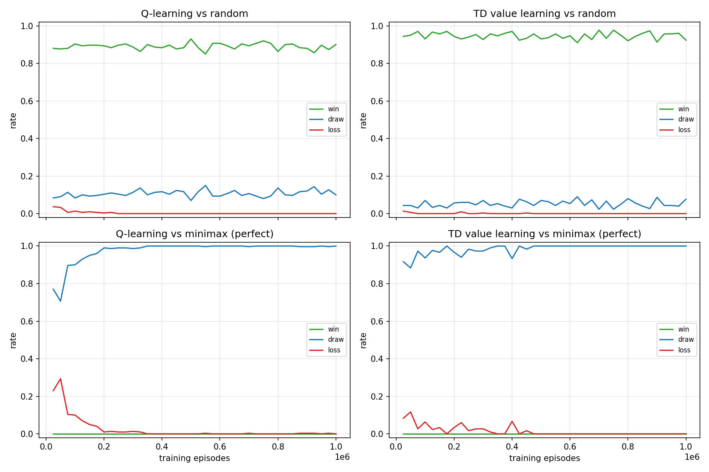

# Tic-Tac-Toe RL

Two tabular reinforcement learning agents that learn to play Tic-Tac-Toe perfectly
through self-play — no labeled data, no hand-coded strategy, just trial and error
guided by a reward signal.

## Results

After 1,000,000 self-play episodes, both agents **never lose a single game against
a perfect (minimax) opponent** — the strongest possible result in Tic-Tac-Toe, since
the game is a forced draw with optimal play on both sides.



- **Top row**: performance vs. a random opponent (win rate climbs).
- **Bottom row**: performance vs. a perfect minimax opponent (loss rate → 0). A
  win here is impossible against perfect play — the meaningful signal is losses
  disappearing while draws take over.

## The two agents

### 1. Q-learning (`agents/q_learning.py`)
Learns `Q(s, a)`: the expected outcome of taking action `a` in state `s`. Classic
off-policy, value-based RL — the same family of algorithm behind DQN and Atari-playing
agents, just with a table instead of a neural network (tractable here because
Tic-Tac-Toe has only ~5,500 reachable states).

### 2. TD(0) value learning (`agents/td_value.py`)
This is the tic-tac-toe example from Sutton & Barto's *Reinforcement Learning: An
Introduction*, Chapter 1. Instead of action-values, it learns `V(s)`: the probability
of eventually winning from board state `s`, and picks whichever move leads to the
state with the highest value.

## Key ideas that made self-play actually work

**Canonical states.** Both agents view the board from the *mover's own perspective*
(`utils.canonical_state`): "my pieces" are always `+1`, "opponent's" always `-1`. This
lets a single table serve both X and O — the agent always answers "how good is this
for whoever is about to move," and effectively doubles the training data per game.

**Negamax-style bootstrapping.** In a zero-sum game, "good for my opponent" means
"bad for me." Both agents exploit this instead of waiting a full extra turn to see
what actually happens:
- The Q-learning update target is `-max_a' Q(next_state, a')` — the best the
  opponent could do next, negated.
- The TD update target is `1 - V(next_state)` — since `P(I win) + P(opponent wins)
  + P(draw) = 1` and a draw is worth `0.5` to both, these two identities are
  mathematically equivalent ways of saying the same thing.

**Optimistic initialization.** Unvisited state-actions start at a *neutral* value
(`0.5`, "assume a draw") rather than `0`. This one change was the difference between
Q-learning plateauing at ~90% draws against a perfect opponent and reaching 100%: with
a zero (pessimistic) default, an under-explored move permanently looks worse than any
mediocre move the agent has already tried, so it stops revisiting it once exploration
(`epsilon`) decays — and the bad estimate never gets corrected.

**Epsilon and learning-rate decay.** Training starts exploratory (`epsilon=0.5`,
`alpha=0.3`) and anneals toward pure exploitation (`epsilon=0`, `alpha=0.02`) so early
learning covers the state space broadly, while late training settles into a stable,
low-noise policy.

## Usage

```bash
python -m venv .venv && source .venv/bin/activate
pip install -r requirements-dev.txt

# Train both agents from scratch (~1-2 minutes), saves models + plots
python train.py

# Play against the trained Q-learning agent
python play.py --agent q --first human

# Play against the trained TD value agent, agent moves first
python play.py --agent td --first agent

# Play against the agent while it learns live from your games (see below)
python train_vs_human.py --agent q

# Check every possible game: can ANY opponent beat the saved agents?
python -m tictactoe.verify

# Patch any weak spot found: fine-tune from random openings, re-check, save if fixed
python finetune.py --agent q
```

## Finding and fixing weak spots

Never losing to minimax doesn't prove an agent is unbeatable: minimax is one
opponent with one (perfect) style, so it never steers into odd positions.
`tictactoe/verify.py` instead walks the whole game tree — every possible opponent
move, and every move the agent might pick when it breaks a tie at random.

That check found a real hole in the original Q-learning model: open on the right
edge (5), and if it answered 3 then 0 → 1, the fork at 8 won. Self-play rarely
opens on an edge, so those positions were barely visited, and an unvisited position
looks like a draw thanks to the optimistic 0.5 default. `finetune.py` fixes this
the RL way: it keeps training from random openings (exploring starts) with
exploration and learning rate annealed back to zero, and only saves the model
once the exhaustive check finds no losing line.

## Playing against a self-play agent always draws — is that a bug?

No — it's the correct game-theoretic outcome. Tic-Tac-Toe is a forced draw with
optimal play on both sides, and the self-play agents above have essentially solved
the game, so a careful human should never beat them (and neither can they beat
you). If you want a *contest*, either play deliberately imperfect moves and watch
it punish them, or use `train_vs_human.py` below to make it adapt specifically to you.

## Learning live against a human (`train_vs_human.py`)

`train.py` trains via **self-play** — the agent's own policy plays both sides.
`train_vs_human.py` instead plays real games against *you* and updates the agent's
table after every move, using the same update rules (negamax bootstrap for
Q-learning, the `1 - V(next)` trick for TD) with your moves standing in for the
self-play opponent. It:

- Loads the already-mastered pretrained model by default and keeps adapting it —
  useful for watching it silently patch a weakness if you find and repeatedly
  exploit one.
- Also corrects the agent's *previous* move directly from the true outcome
  whenever one of your moves ends the game, rather than relying on many repeated
  self-play visits to smooth the estimate out — with only a handful of human
  games to learn from, there isn't time for that patience.
- Saves progress back to `saved_models/` after every game, so improvements persist
  across sessions.
- Alternates which side you play each game, so the shared state table gets
  balanced X/O experience.

```bash
python train_vs_human.py --agent q                 # continue training the pretrained agent against you
python train_vs_human.py --agent q --first agent    # let the agent move first
python train_vs_human.py --agent td --fresh         # train a BLANK agent purely from your games
```

`--fresh` is mostly a demonstration of the learning mechanics, not a path to
mastery: self-play needed on the order of a million games to reach perfect play,
and a human can realistically supply a few dozen per sitting — expect it to stay
weak and inconsistent, occasionally missing wins or blocks, rather than to
noticeably "master" the game in one session.

## Web app

Play in the browser (works on a phone):

```bash
python -m webapp        # http://<lan-ip>:5000, same wifi only
./serve.sh              # same, plus a temporary public Cloudflare tunnel URL
```

Every browser gets its own game and its own copy of the agents, so visitors never
interfere with each other, and learning from web games stays in memory: it never
changes `saved_models/`. The exception is `serve.sh`, which sets `TTT_PERSIST=1`
so *your own* games keep training the saved models, like `train_vs_human.py`.

## Deploying to GitHub Pages (free, no server)

`build_static.py` builds a static version of the web app into `site/`: the same
page and the same Python game code (`webapp/api.py`, `webapp/game.py`,
`tictactoe/`), run in the visitor's browser by [Pyodide](https://pyodide.org).
Each visitor gets a private game automatically, and nothing they do touches the repo.

```bash
python build_static.py && python -m http.server -d site   # preview at http://localhost:8000
```

`.github/workflows/pages.yml` rebuilds and publishes it on every push to `main`.
One-time setup: in the repo's **Settings → Pages**, set **Source** to **GitHub Actions**.

The Flask app and `Dockerfile` still work for hosting on a server (e.g. Render),
which the image supports by listening on `$PORT`.

## Files

| Path | Purpose |
|---|---|
| `tictactoe/env.py` | Game rules: board, win detection, step/reset |
| `tictactoe/utils.py` | State canonicalization, pickle helpers |
| `tictactoe/agents/` | Q-learning, TD(0) value, random, and minimax (evaluation-only) agents |
| `tictactoe/models.py` | Saved-model paths; loading/saving agents |
| `tictactoe/training.py` | Self-play episodes, training loop, fine-tuning, evaluation, episodes vs a human |
| `tictactoe/learning.py` | Per-move learning updates against a human (CLI and web app) |
| `tictactoe/verify.py` | Exhaustive check: every game any opponent could play |
| `tictactoe/plotting.py` | Training curves |
| `tictactoe/console.py` | Terminal board rendering and move input |
| `train.py` | CLI: train both agents from scratch, save models and plot |
| `finetune.py` | CLI: patch weak spots in a saved agent, verified exhaustively |
| `play.py` | CLI: play a fixed (non-learning) trained agent |
| `train_vs_human.py` | CLI: play the agent while it keeps learning from your games |
| `webapp/` | Web app (`app.py` Flask routes, `game.py` per-visitor game, `sessions.py` store) |
| `serve.sh` | Run the web app locally with a temporary public tunnel |
| `webapp/api.py` | The JSON API as plain functions, shared by Flask and the static build |
| `build_static.py`, `static/` | Static GitHub Pages build (Pyodide) |
| `.github/workflows/pages.yml` | Publishes the static build to GitHub Pages |
| `Dockerfile` | Container image for server hosting |

## Suggested next steps

- Swap the tabular `Q`/`V` dict for a small neural network (a few hundred hidden
  units is overkill but a fun way to see function approximation in action) and
  compare sample efficiency.
- Try Tic-Tac-Toe on a bigger board (4x4, win with 3-in-a-row) where the state
  space is too large for exact minimax evaluation, and see how much longer
  training takes to reach a strong (not necessarily provably perfect) policy.
- Add a SARSA agent (on-policy Q-learning) alongside these two and compare
  convergence behavior — the TD agent here already behaves a lot like SARSA
  because it bootstraps off the actually-realized next state rather than an
  assumed-optimal one.
